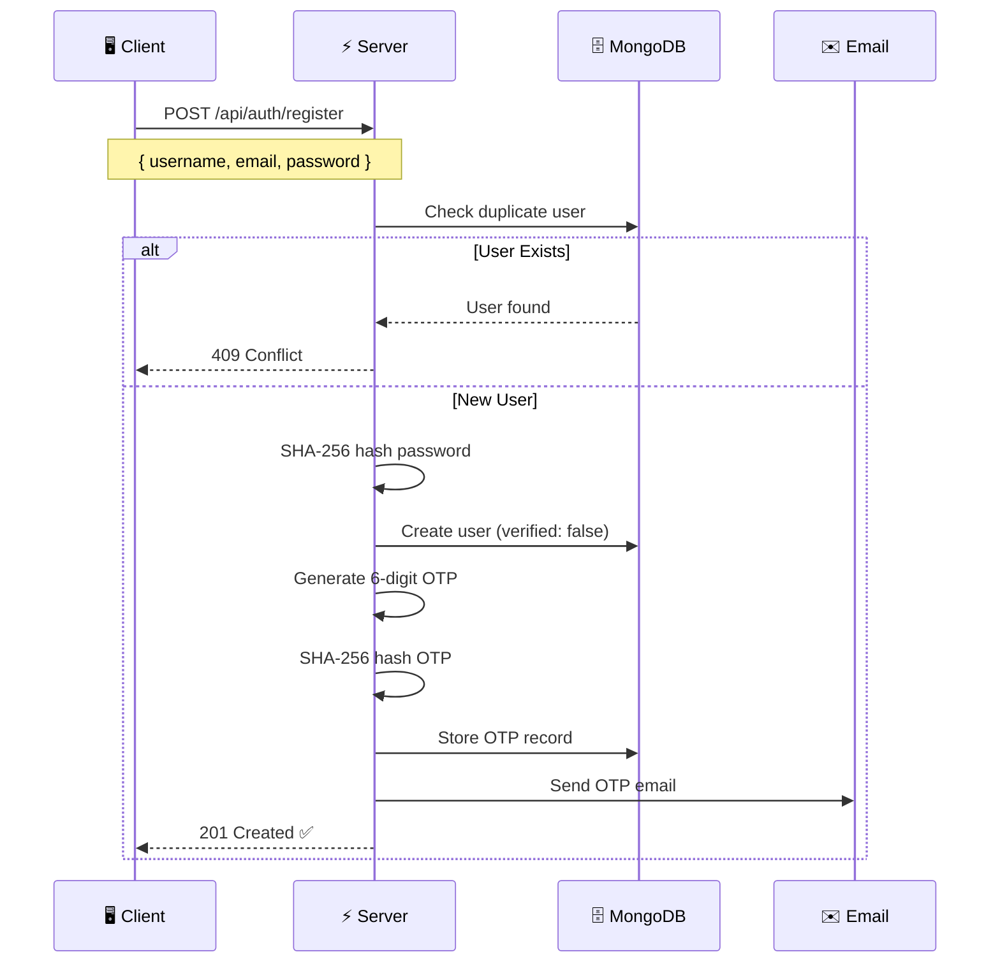
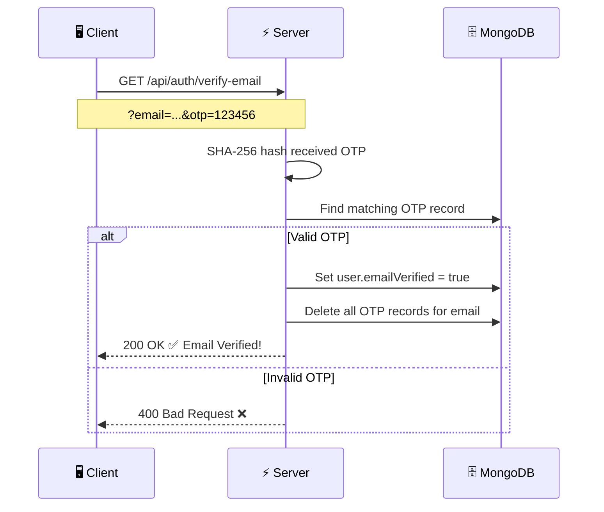
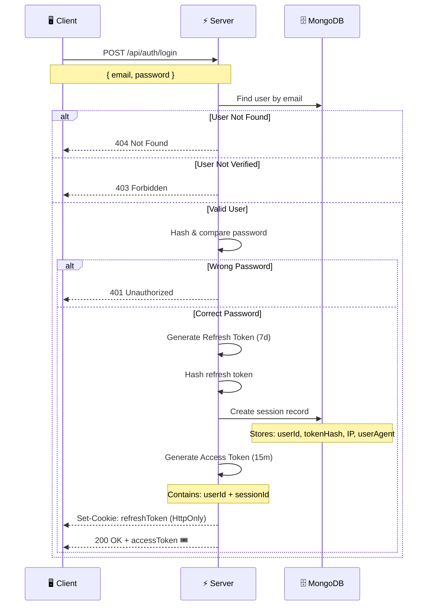
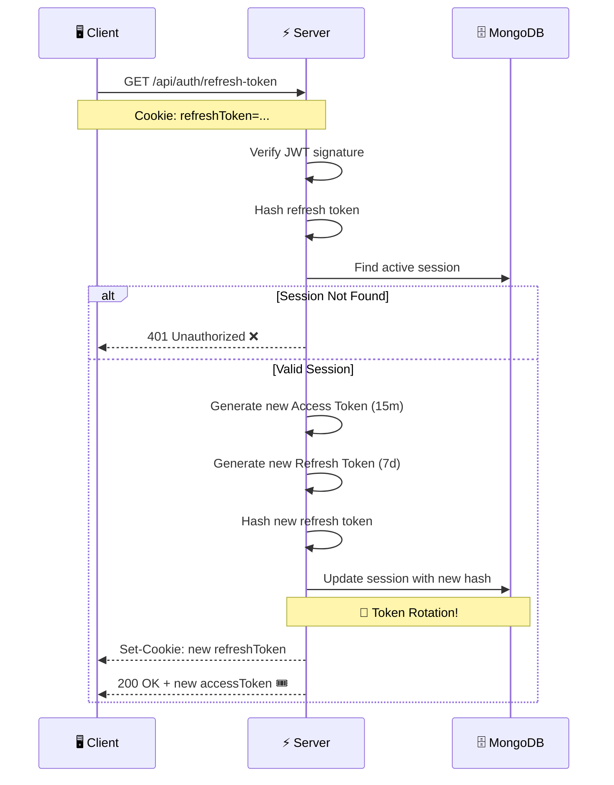
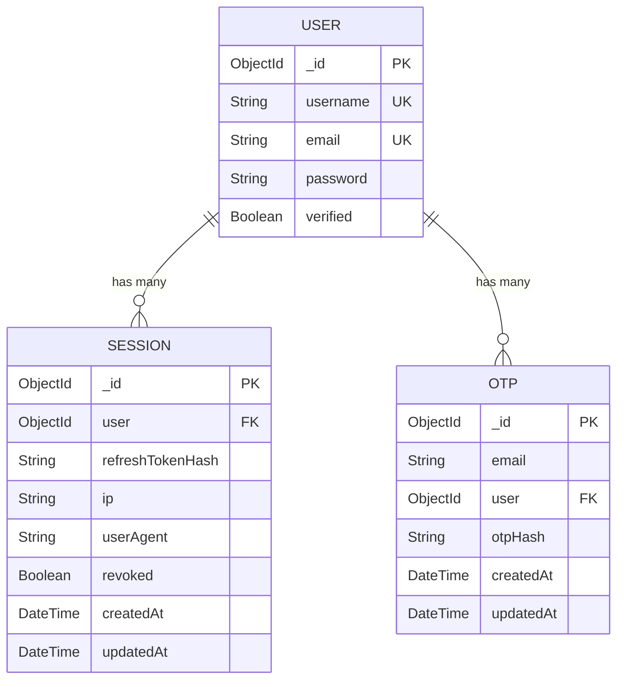

<div align="center">

<!-- Animated Header Banner -->


<!-- Typing Animation -->
<a href="https://git.io/typing-svg"></a>

<br/>

<!-- Animated Badges -->
[](https://nodejs.org/)
[](https://expressjs.com/)
[](https://www.mongodb.com/)
[](https://jwt.io/)
[](https://nodemailer.com/)

<br/>

<!-- Stats Badges -->


</div>

<br/>

<!-- Animated Divider -->


<br/>

## 🌟 Overview

> **Auth Workflow** is a **production-grade**, **session-based authentication system** built with modern Node.js best practices. It implements the full auth lifecycle — registration, email verification via OTP, login with dual JWT tokens, session management, and secure logout — all wrapped in a clean, modular architecture.

<br/>

<!-- Architecture Animation -->
<div align="center">

```
╔══════════════════════════════════════════════════════════════════════╗
║                                                                      ║
║   ┌──────────┐     ┌──────────┐     ┌──────────┐     ┌──────────┐   ║
║   │  Client  │────▶│  Express │────▶│Controllers│────▶│  MongoDB │   ║
║   │  (API)   │◀────│  Router  │◀────│ + Services│◀────│  Models  │   ║
║   └──────────┘     └──────────┘     └──────────┘     └──────────┘   ║
║        │                                    │                        ║
║        │            ┌──────────┐            │                        ║
║        └───────────▶│   JWT    │◀───────────┘                        ║
║                     │  Tokens  │                                     ║
║                     └──────────┘                                     ║
║                                                                      ║
╚══════════════════════════════════════════════════════════════════════╝
```

</div>

<br/>


## ✨ Features

<div align="center">
<table>
<tr>
<td align="center" width="25%">

### 🔐
### Secure Registration
SHA-256 password hashing with duplicate user detection

</td>
<td align="center" width="25%">

### ✉️
### Email Verification
6-digit OTP sent via Gmail OAuth2 with Nodemailer

</td>
<td align="center" width="25%">

### 🎟️
### Dual JWT Tokens
15min Access Token + 7-day Refresh Token rotation

</td>
<td align="center" width="25%">

### 🛡️
### Session Management
Per-device sessions with IP & User-Agent tracking

</td>
</tr>
<tr>
<td align="center" width="25%">

### 🔄
### Token Refresh
Automatic refresh token rotation for enhanced security

</td>
<td align="center" width="25%">

### 🚪
### Smart Logout
Single device & all-device logout support

</td>
<td align="center" width="25%">

### 🍪
### Secure Cookies
HttpOnly, Secure, SameSite=Strict cookie config

</td>
<td align="center" width="25%">

### 📦
### Modular Code
Clean MVC architecture with service layer

</td>
</tr>
</table>
</div>

<br/>


## 🔄 Authentication Flow

<div align="center">

### 📝 Registration Flow



<br/>

### ✉️ Email Verification Flow



<br/>

### 🔑 Login Flow



<br/>

### 🔄 Token Refresh Flow



<br/>

### 🚪 Logout Flow

```mermaid
sequenceDiagram
    participant C as 🖥️ Client
    participant S as ⚡ Server
    participant DB as 🗄️ MongoDB

    rect rgb(40, 20, 60)
        Note over C,DB: Single Device Logout
        C->>S: GET /api/auth/logout
        S->>S: Hash refresh token from cookie
        S->>DB: Find & revoke session
        S-->>C: Clear cookie + 200 OK ✅
    end

    rect rgb(20, 40, 60)
        Note over C,DB: All Devices Logout
        C->>S: GET /api/auth/logout-all
        S->>S: Decode refresh token
        S->>DB: Revoke ALL user sessions
        S-->>C: Clear cookie + 200 OK ✅
    end
```



</div>

<br/>


## 🏗️ Project Architecture

```
auth-workflow/
│
├── 📄 server.js                  # Entry point — starts Express & connects DB
├── 📄 package.json               # Dependencies & scripts
├── 📄 .env                       # Environment variables (secrets)
├── 📄 .gitignore
│
└── 📁 src/
    ├── 📄 app.js                 # Express app configuration & middleware
    │
    ├── 📁 config/
    │   ├── 📄 config.js          # Environment variable validation & export
    │   └── 📄 database.js        # MongoDB connection via Mongoose
    │
    ├── 📁 controllers/
    │   └── 📄 auth.controller.js # All auth logic (register, login, etc.)
    │
    ├── 📁 models/
    │   ├── 📄 user.schema.js     # User model (username, email, password, verified)
    │   ├── 📄 session.model.js   # Session model (tokenHash, IP, userAgent, revoked)
    │   └── 📄 otp.model.js       # OTP model (email, user ref, otpHash)
    │
    ├── 📁 routes/
    │   └── 📄 auth.route.js      # Route definitions → controller mapping
    │
    ├── 📁 services/
    │   └── 📄 email.service.js   # Nodemailer transporter (Gmail OAuth2)
    │
    └── 📁 utils/
        └── 📄 utils.js           # OTP generator & email HTML template
```

<br/>


## 🚀 API Endpoints

<div align="center">

| Method | Endpoint | Description | Auth Required |
|:------:|:---------|:------------|:-------------:|
| `POST` | `/api/auth/register` | Register a new user | ❌ |
| `GET` | `/api/auth/verify-email` | Verify email with OTP | ❌ |
| `POST` | `/api/auth/login` | Login & get tokens | ❌ |
| `GET` | `/api/auth/getme` | Get current user profile | ✅ Bearer Token |
| `GET` | `/api/auth/refresh-token` | Refresh access token | 🍪 Cookie |
| `GET` | `/api/auth/logout` | Logout current device | 🍪 Cookie |
| `GET` | `/api/auth/logout-all` | Logout all devices | 🍪 Cookie |

</div>

<br/>

<details>
<summary><b>📋 Detailed API Reference (click to expand)</b></summary>

<br/>

### `POST` /api/auth/register

**Request Body:**
```json
{
  "username": "nitesh",
  "email": "nitesh@example.com",
  "password": "securePassword123"
}
```

**Success Response** `201`:
```json
{
  "message": "user registered successfully",
  "newUser": {
    "username": "nitesh",
    "email": "nitesh@example.com",
    "verified": false
  }
}
```

**Error Response** `409`:
```json
{
  "message": "user already exists"
}
```

---

### `GET` /api/auth/verify-email

**Query Parameters:** `?email=nitesh@example.com&otp=123456`

**Success Response** `200`:
```json
{
  "message": "email verified successfully",
  "user": {
    "username": "nitesh",
    "email": "nitesh@example.com",
    "verified": true
  }
}
```

---

### `POST` /api/auth/login

**Request Body:**
```json
{
  "email": "nitesh@example.com",
  "password": "securePassword123"
}
```

**Success Response** `200`:
```json
{
  "message": "user login successful",
  "accessToken": "eyJhbGciOiJIUzI1NiIs..."
}
```
> 🍪 Also sets `refreshToken` as an HttpOnly cookie

---

### `GET` /api/auth/getme

**Headers:** `Authorization: Bearer <accessToken>`

**Success Response** `200`:
```json
{
  "message": "user fetched successfully",
  "user": {
    "username": "nitesh",
    "email": "nitesh@example.com"
  }
}
```

---

### `GET` /api/auth/refresh-token

> 🍪 Requires `refreshToken` cookie

**Success Response** `200`:
```json
{
  "message": "access token refreshed successfully",
  "accessToken": "eyJhbGciOiJIUzI1NiIs..."
}
```

---

### `GET` /api/auth/logout

> 🍪 Requires `refreshToken` cookie

**Success Response** `200`:
```json
{
  "message": "user logged out successfully"
}
```

---

### `GET` /api/auth/logout-all

> 🍪 Requires `refreshToken` cookie

**Success Response** `200`:
```json
{
  "message": "user logged out from all devices successfully"
}
```

</details>

<br/>


## 🔒 Security Highlights

<div align="center">

```
   ┌─────────────────────────────────────────────────────────────┐
   │                    🛡️  SECURITY LAYERS                      │
   │                                                             │
   │  ┌─────────────────────────────────────────────────────┐   │
   │  │  Layer 1: Password Hashing                          │   │
   │  │  └── SHA-256 cryptographic hash                     │   │
   │  │      └── Never store plaintext passwords            │   │
   │  └─────────────────────────────────────────────────────┘   │
   │                         ▼                                   │
   │  ┌─────────────────────────────────────────────────────┐   │
   │  │  Layer 2: Dual Token Strategy                       │   │
   │  │  ├── Access Token  → 15 min lifespan (in response)  │   │
   │  │  └── Refresh Token → 7 day lifespan (HttpOnly cookie│   │
   │  └─────────────────────────────────────────────────────┘   │
   │                         ▼                                   │
   │  ┌─────────────────────────────────────────────────────┐   │
   │  │  Layer 3: Refresh Token Rotation                    │   │
   │  │  └── New refresh token issued on each refresh       │   │
   │  │      └── Old token invalidated (replay protection)  │   │
   │  └─────────────────────────────────────────────────────┘   │
   │                         ▼                                   │
   │  ┌─────────────────────────────────────────────────────┐   │
   │  │  Layer 4: Session Tracking                          │   │
   │  │  ├── Per-device session records                     │   │
   │  │  ├── IP address logging                             │   │
   │  │  ├── User-Agent fingerprinting                      │   │
   │  │  └── Revocation support (single & all devices)      │   │
   │  └─────────────────────────────────────────────────────┘   │
   │                         ▼                                   │
   │  ┌─────────────────────────────────────────────────────┐   │
   │  │  Layer 5: Cookie Hardening                          │   │
   │  │  ├── HttpOnly  → No JavaScript access               │   │
   │  │  ├── Secure    → HTTPS only                         │   │
   │  │  └── SameSite  → Strict (CSRF protection)           │   │
   │  └─────────────────────────────────────────────────────┘   │
   │                         ▼                                   │
   │  ┌─────────────────────────────────────────────────────┐   │
   │  │  Layer 6: Email Verification                        │   │
   │  │  ├── 6-digit OTP via Gmail OAuth2                   │   │
   │  │  └── OTP stored as SHA-256 hash                     │   │
   │  └─────────────────────────────────────────────────────┘   │
   │                                                             │
   └─────────────────────────────────────────────────────────────┘
```

</div>

<br/>


## ⚡ Quick Start

### Prerequisites

<div align="center">

| Requirement | Version |
|:-----------:|:-------:|
| Node.js | `18+` |
| MongoDB | `6+` |
| Gmail Account | With OAuth2 |

</div>

### 1️⃣ Clone the Repository

```bash
git clone https://github.com/samotanitesh247-ship-it/Auth-workflow.git
cd Auth-workflow
```

### 2️⃣ Install Dependencies

```bash
npm install
```

### 3️⃣ Configure Environment Variables

Create a `.env` file in the root directory:

```env
# 🗄️ Database
MONGO_URI=mongodb://localhost:27017/auth-workflow

# 🔑 JWT
JWT_SECRET=your-super-secret-jwt-key

# ✉️ Gmail OAuth2 (for email verification)
GOOGLE_USER_ID=your-email@gmail.com
GOOGLE_CLIENT_ID=your-google-client-id
GOOGLE_CLIENT_SECRET=your-google-client-secret
GOOGLE_REFRESH_TOKEN=your-google-refresh-token
```

<details>
<summary>📖 <b>How to get Gmail OAuth2 credentials</b></summary>

1. Go to [Google Cloud Console](https://console.cloud.google.com/)
2. Create a new project
3. Enable the **Gmail API**
4. Create **OAuth 2.0 credentials** (Web Application type)
5. Set the redirect URI to `https://developers.google.com/oauthplayground`
6. Go to [OAuth Playground](https://developers.google.com/oauthplayground/)
7. Click ⚙️ → Check **"Use your own OAuth credentials"**
8. Enter your Client ID & Secret
9. Select `https://mail.google.com/` scope → Authorize → Exchange for tokens
10. Copy the **refresh token** to your `.env`

</details>

### 4️⃣ Start the Server

```bash
npm run dev
```

<div align="center">

```
🚀 Server is running on port 3000
🗄️ Database connected successfully
✉️ Email transporter is ready to send messages
```

</div>

<br/>


## 🧪 Testing with cURL

```bash
# 📝 Register
curl -X POST http://localhost:3000/api/auth/register \
  -H "Content-Type: application/json" \
  -d '{"username":"nitesh","email":"nitesh@example.com","password":"test123"}'

# ✉️ Verify Email (use OTP received via email)
curl "http://localhost:3000/api/auth/verify-email?email=nitesh@example.com&otp=123456"

# 🔑 Login
curl -X POST http://localhost:3000/api/auth/login \
  -H "Content-Type: application/json" \
  -d '{"email":"nitesh@example.com","password":"test123"}' \
  -c cookies.txt

# 👤 Get Profile
curl http://localhost:3000/api/auth/getme \
  -H "Authorization: Bearer YOUR_ACCESS_TOKEN"

# 🔄 Refresh Token
curl http://localhost:3000/api/auth/refresh-token \
  -b cookies.txt -c cookies.txt

# 🚪 Logout
curl http://localhost:3000/api/auth/logout \
  -b cookies.txt

# 🚪 Logout All Devices
curl http://localhost:3000/api/auth/logout-all \
  -b cookies.txt
```

<br/>


## 🗃️ Database Models

<div align="center">



</div>

<br/>


## 🛠️ Tech Stack

<div align="center">

| Technology | Purpose |
|:----------:|:--------|
|  | Web framework & routing |
|  | MongoDB ODM |
|  | Access & Refresh tokens |
|  | OTP email delivery |
|  | HTTP request logging |
|  | Secure cookie handling |
|  | Environment variable management |
|  | SHA-256 hashing |

</div>

<br/>


## 🤝 Contributing

Contributions are always welcome! Here's how:

```bash
# Fork the repo, then:
git checkout -b feature/amazing-feature
git commit -m "✨ Add amazing feature"
git push origin feature/amazing-feature
# Open a Pull Request 🎉
```

<br/>


## 📄 License

This project is licensed under the **ISC License**.

<br/>

<div align="center">

### ⭐ Star this repo if you found it useful!

<br/>

<!-- Animated Footer -->


</div>
